# Ifthenpay payment extension for Opencart 3

Download latest version of the ifthenpay extension for Opencart 3.
| | Opencart 3 [3.0.1.1 - 3.0.3.9] |
| ------------------------------------- | --------------------------------- |
| Link to download installer .ocmod.zip | [ifthenpay v1.4.3](https://github.com/ifthenpay/opencart/releases/download/1.4.3/ifthenpay.ocmod.zip) |

 
 

Read in  [Portuguese](readme.pt.md), or  [English](readme.md)

[1. Introduction](#introduction)

[2. Compatibility](#compatibility)

[3. Installation](#installation)

[4. Configuration](#configuration)

- [Backoffice Key](#backoffice-key)
- [Multibanco](#multibanco)
- [Multibanco with Dynamic References](#multibanco-with-dynamic-references)
- [MB WAY](#mb-way)
- [Credit Card](#credit-card)
- [Payshop](#payshop)
- [Cofidis Pay](#cofidis-pay)
- [Pix](#pix)
- [Ifthenpay Gateway](#ifthenpay-gateway)

[5. Other](#other)

- [Payment Instruction Message](#payment-instruction-message)
- [Request additional account](#request-additional-account)
- [Reset Configuration](#reset-configuration)
- [Callback](#callback)
- [Test Callback](#test-callback)
- [Cronjob](#cronjob)
- [Logs](#logs)

[6. Customer usage experience](#customer-usage-experience)

- [Ifthenpay payment extension for Opencart 3](#ifthenpay-payment-extension-for-opencart-3)
- [Introduction](#introduction)
- [Compatibility](#compatibility)
- [Installation](#installation)
- [Configuration](#configuration)
  - [Backoffice Key](#backoffice-key)
  - [Multibanco](#multibanco)
  - [Multibanco with Dynamic References](#multibanco-with-dynamic-references)
  - [MB WAY](#mb-way)
  - [Credit Card](#credit-card)
  - [Payshop](#payshop)
  - [Cofidis Pay](#cofidis-pay)
  - [Pix](#pix)
  - [Ifthenpay Gateway](#ifthenpay-gateway)
- [Other](#other)
  - [Request additional account](#request-additional-account)
  - [Reset Configuration](#reset-configuration)
  - [Callback](#callback)
  - [Test Callback](#test-callback)
  - [Cronjob](#cronjob)
  - [Logs](#logs)
- [Customer usage experience](#customer-usage-experience)
  - [Paying order with Multibanco](#paying-order-with-multibanco)
  - [Paying order with Payshop](#paying-order-with-payshop)
  - [Paying order with MB WAY](#paying-order-with-mb-way)
  - [Paying order with Credit Card](#paying-order-with-credit-card)
  - [Paying order with Cofidis Pay](#paying-order-with-cofidis-pay)
  - [Paying order with Pix](#paying-order-with-pix)
  - [Paying order with Ifthenpay Gateway](#paying-order-with-ifthenpay-gateway)

 

## Introduction

 
**This is the ifthenpay extension for the Opencart ecommerce platform.**

**Multibanco** is a Portuguese payment method that allows the consumer to pay through a bank reference. This extension enables the generation of payment references that the consumer can use to pay for their order at an ATM (Multibanco) or through an online home banking service. This extension utilizes ifthenpay, one of the various available gateways in Portugal.

**MB WAY** is the first inter-bank solution that enables immediate purchases and transfers through smartphones and tablets. This extension allows generating a payment request on the consumer's smartphone, and they can authorize the payment for their order through the MB WAY application. This extension utilizes ifthenpay, one of the various available gateways in Portugal.

**Payshop** is a Portuguese payment method that allows the consumer to pay with a Payshop reference. This extension enables the generation of a payment reference that the consumer can use to pay for their order at a Payshop agent or CTT (Portuguese postal service). This extension uses ifthenpay, one of the various gateways available in Portugal.

**Credit Card** This extension allows generating a payment through Visa or MasterCard, which the consumer can use to pay for their order. This extension uses ifthenpay, one of the various gateways available in Portugal.

**Cofidis Pay** is a payment solution of up to 12 interest-free installments that makes it easier to pay for purchases by splitting them. This extension uses one of the several gateways/services available in Portugal, IfthenPay.

**Pix** is an instant payment solution widely used in the Brazilian financial market. It enables quick and secure transactions for purchases, using details such as CPF, email, and phone number to complete the payment.

**Ifthenpay Gateway** is a payment gateway page that provides all the payment methods above in one place. This extension uses ifthenpay, one of the various gateways available in Portugal.

**Contract with Ifthenpay is required**

See more at [ifthenpay](https://ifthenpay.com).

Membership at [Membership ifthenpay](https://www.ifthenpay.com/aderir/).

**Support**

For support, please create a support ticket at [Support ifthenpay](https://helpdesk.ifthenpay.com/).

 

## Compatibility

Use the table below to check the compatibility of the Ifthenpay extension with your online store:

| | Opencart 3 [3.0.1.1 - 3.0.3.9] | Opencart 4 |
| ------------------------- | ------------------------------ | ------------------------------ |
| ifthenpay v1.0.0 - v1.4.3 | Compatible | Not compatible |

 

## Installation

Please download the installation file of the ifthenpay extension for Opencart 3 from the GitHub page [ifthenpay v1.4.3](https://github.com/ifthenpay/opencart/releases/tag/v1.4.3).
You may get from multiple places in this repository:

- the link in this instruction line;
- the releases page where you may chose the version you need, but beware that ifthenpay releases the extensions for both version 3 and 4 of Opencart in this repository;
- the main readme in the repository and choosing the opencart 3 compatible download (1);
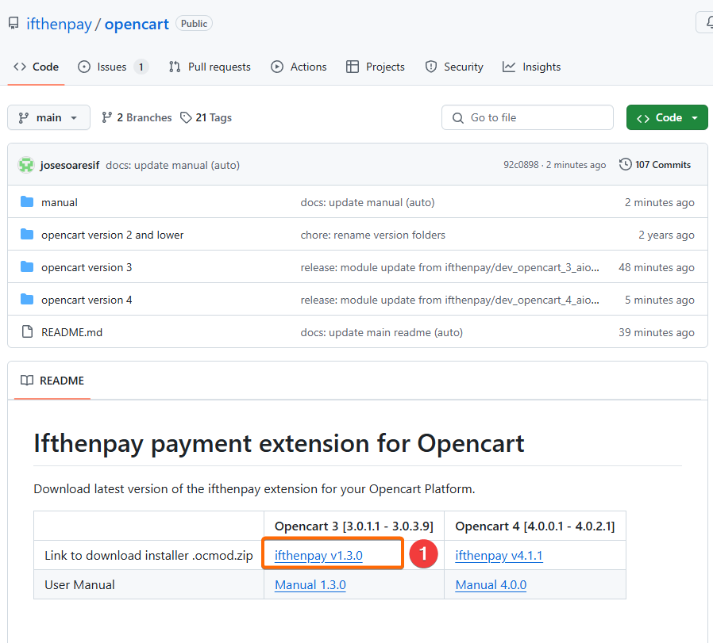
 

Access the backoffice of your online store and select Extensions (1) -> Installer (2), then click on Upload (3).

 

Select the file with the .ocmod.zip extension (1) that you previously downloaded, and click on Open (2).

 

If the upload is successful, a success message will be displayed, and the extension will be listed in the group of installed extensions. However, you've only uploaded the extension; you still need to install it. To do this, click on the Install button (1).

 

If the installation is successful, a success message will be displayed, and the Install button will change color to orange.
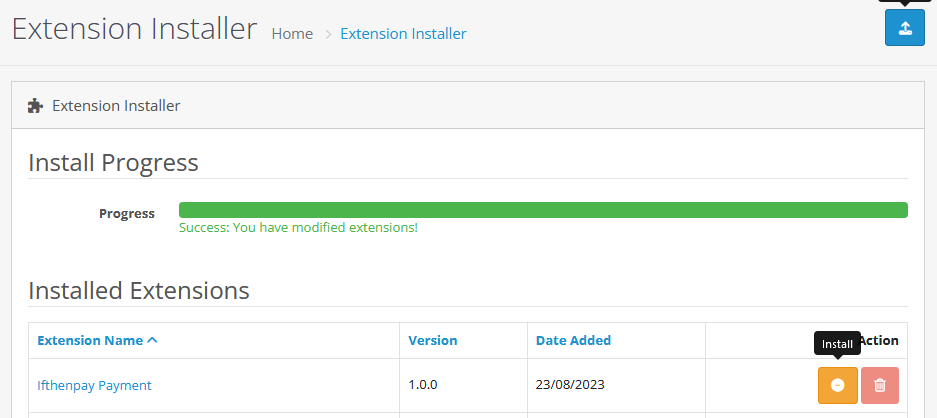
 

After installing the extension, you need to configure the payment methods you want to offer in your online store. To do this, access the payment extensions page.
Select Extensions (1) -> Extensions (2) -> Payments (3).

 

Find the payment method you want to install (e.g., Multibanco) and click on "Install" (1).
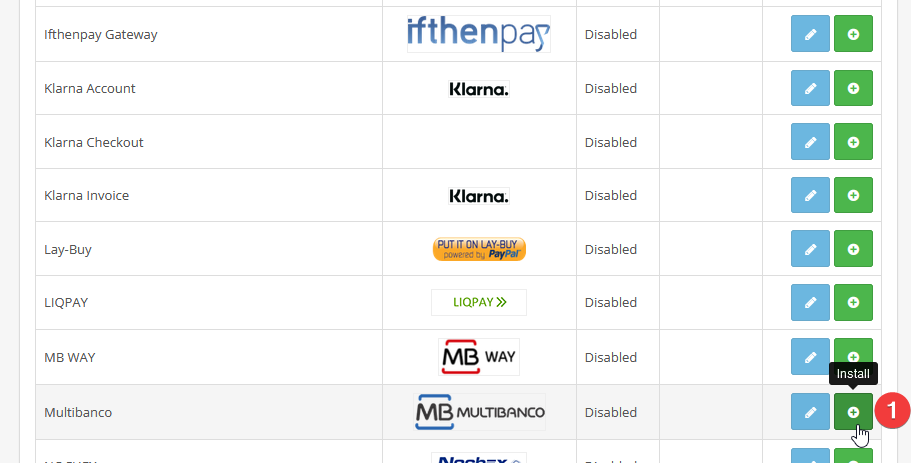

 

## Configuration

After installing the payment method, you need to configure it using your ifthenpay account details.
Click on "Edit" (1) for the payment method you want to configure (e.g., Multibanco).

 

### Backoffice Key

Each payment method configuration requires entering the Backoffice Key to load the available accounts. The Backoffice Key is provided upon contract completion and consists of sets of four digits separated by a hyphen (-).
Below is an example for Multibanco, and this action is the same for other payment methods as well.
Enter the Backoffice Key (1) and click on Save (2). The page will reload, displaying the configuration form again.
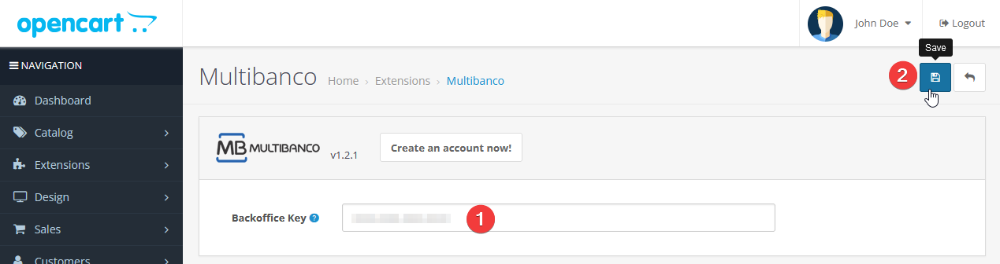

 

### Multibanco

The Multibanco payment method generates references using an algorithm and is used if you don't want to set a time limit (in days) for orders paid with Multibanco.
The Entity and Sub-Entity are automatically loaded upon entering the Backoffice Key.
Configure the payment method. The image below shows an example of a minimally functional configuration.

1. **Status** - Activates the payment method, displaying it at the checkout of your store.
2. **Sandbox** - Prevents activation of callback when saving configuration.
3. **Enable Callback** - When enabled, the order status will be updated when the payment is received.
4. **Enable Cancel Cron Job** - When enabled, allows the order cancellation cron job to run for this specific method (used when you don't want the cron job to run for all payment methods).
5. **Entity** - Select an Entity. You can only choose one of the Entities associated with the Backoffice Key.
6. **Sub-entity** - Select a Sub-Entity. You can only choose one of the Sub-Entities associated with the Entity chosen earlier.
7. **Canceled Status** - Order status used during order confirmation.
8. **Pending Status** - Order status used during order confirmation.
9. **Paid Status** - Order status used when payment confirmation is received.
10. **Geo Zone** - (optional) By selecting a geographic zone, this payment method will only be displayed for orders with a shipping address within the chosen zone.
11. **Minimum Amount** - (optional) Displays this payment method only for orders with a value greater than the entered amount.
12. **Maximum Amount** - (optional) Displays this payment method only for orders with a value lower than the entered amount.
13. **Show Payment Method Logo** - (optional) Display this payment method logo image on checkout, disabling this option will display the Payment Method Title.
14. **Payment Method Instruction** - (optional) Displays an instruction message at the checkout. Used to inform the customer about the chosen payment method. Can be edited in the translations files.
15. **Payment Method Title** - Payment name to display in case payment method logo is not displayed.
16. **Sort Order** - (optional) Sorts the payment methods on the checkout page in ascending order. Lower numbers take the first position.

Click on Save (17) to save the changes.

 

### Multibanco with Dynamic References

The Multibanco payment method with Dynamic References generates references per order and is used if you wish to set a time limit (in days) for orders paid with Multibanco.
The Entity and Multibanco Key are automatically loaded upon entering the Backoffice Key.
Configure the payment method. The image below shows an example of a minimally functional configuration.

Follow the steps for configuring Multibanco (as indicated above) with the following change:

1. **Entity** - Select "Dynamic Multibanco References," this entity will only be available for selection if you've entered into a contract for the creation of a Dynamic Multibanco References account.
2. **SubEntity** - Select a Multibanco SubEntity. You can only choose one of the Multibanco SubEntities associated with the Entity chosen earlier.
3. **Deadline** - Select the number of days the Multibanco reference will be valid. Leaving this field empty will mean that the Multibanco reference does not expire.

Examples of deadlines:

- Choosing a deadline of 0 days: If an order is created on 22/03/2023 at 15:30, the generated Multibanco reference will expire on 22/03/2023 at 23:59, which is the end of the day it was generated.
- Choosing a deadline of 1 day: If an order is created on 22/03/2023 at 9:30, the generated Multibanco reference will expire on 23/03/2023 at 23:59, which means the Multibanco reference will be valid for the day it was generated plus 1 day.
- Choosing a deadline of 3 days: If an order is created on 22/03/2023 at 20:30, the generated Multibanco reference will expire on 25/03/2023 at 23:59, which means the Multibanco reference will be valid for the day it was generated plus 3 days.

Click on Save (4) to save the changes.
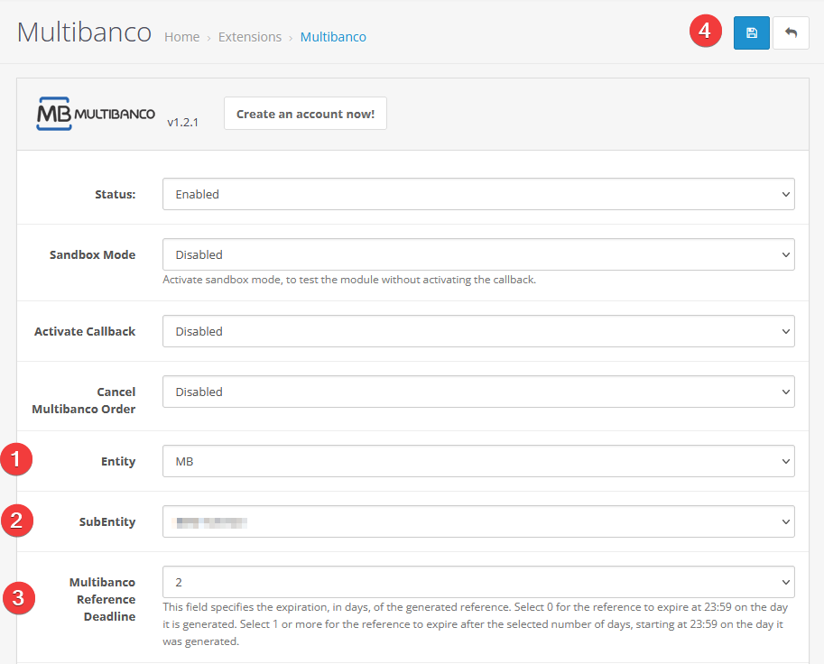

 

### MB WAY

The MB WAY payment method utilizes a mobile phone number provided by the consumer and generates a payment request within the MB WAY smartphone application. The consumer can then accept or decline the payment.
The MB WAY Keys are automatically loaded upon entering the Backoffice Key.
Configure the payment method. The image below shows an example of a minimally functional configuration.

1. **Status** - Activates the payment method, displaying it at the checkout of your store.
2. **Sandbox** - Prevents activation of callback when saving configuration.
3. **Enable Callback** - When enabled, the order status will be updated when the payment is received.
4. **Enable Cancel Cron Job** - When enabled, allows the order cancellation cron job to run for this specific method (used when you don't want the cron job to run for all payment methods).
5. **MB WAY Key** - Select a Key. You can only choose one of the Keys associated with the Backoffice Key.
6. **Canceled Status** - Order status used when the order is canceled.
7. **Pending Status** - Order status used during order confirmation.
8. **Paid Status** - Order status used when payment confirmation is received.
9. **Geo Zone** - (optional) By selecting a geographic zone, this payment method will only be displayed for orders with a shipping address within the chosen zone.
10. **Minimum Amount** - (optional) Displays this payment method only for orders with a value greater than the entered amount.
11. **Maximum Amount** - (optional) Displays this payment method only for orders with a value lower than the entered amount.
12. **Description** - (optional) Displays this description to customer in MB WAY phone App, use the string {{order_id}} to pass the order_id number.
13. **Show Payment Method Logo** - (optional) Display this payment method logo image on checkout, disabling this option will display the Payment Method Title.
14. **Title** - The title that appears to the consumer during checkout.
15. **Payment Method Instruction** - (optional) Displays an instruction message at the checkout. Used to inform the customer about the chosen payment method. Can be edited in the translations files.
16. **Sort Order** - (optional) Sorts the payment methods on the checkout page in ascending order. Lower numbers take the first position.

Click on Save (17) to save the changes.
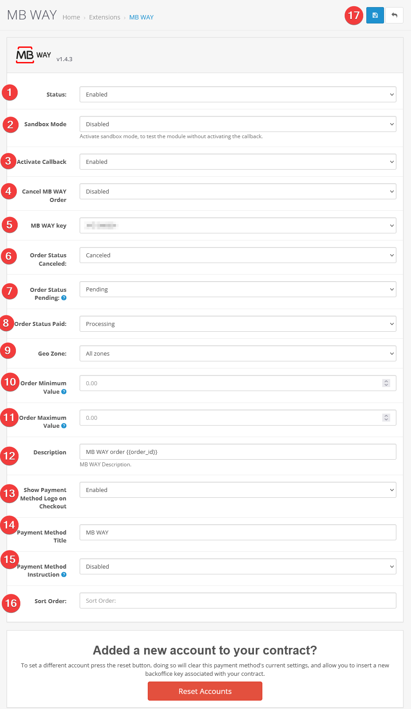

 

### Credit Card

The Credit Card payment method allows payment with Visa or Mastercard through the ifthenpay gateway.
The Credit Card Keys are automatically loaded upon entering the Backoffice Key.
Configure the payment method. The image below shows an example of a minimally functional configuration.

1. **Status** - Activates the payment method, displaying it at the checkout of your store.
2. **Enable Cancel Cron Job** - When enabled, allows the order cancellation cron job to run for this specific method (used when you don't want the cron job to run for all payment methods).
3. **Credit Card Key** - Select a Key. You can only choose one of the Keys associated with the Backoffice Key.
4. **Canceled Status** - Order status used when the order is canceled.
5. **Failed Status** - Order status used when payment fails while requesting transaction.
6. **Pending Status** - Order status used during order confirmation.
7. **Paid Status** - Order status used when payment confirmation is received.
8. **Geo Zone** - (optional) By selecting a geographic zone, this payment method will only be displayed for orders with a shipping address within the chosen zone.
9. **Minimum Amount** - (optional) Displays this payment method only for orders with a value greater than the entered amount.
10. **Maximum Amount** - (optional) Displays this payment method only for orders with a value lower than the entered amount.
11. **Show Payment Method Logo** - Display this payment method logo image on checkout, disabling this option will display the Payment Method Title.
12. **Title** - The title that appears to the consumer during checkout.
13. **Payment Method Instruction** - (optional) Displays an instruction message at the checkout. Used to inform the customer about the chosen payment method. Can be edited in the translations files.
14. **Sort Order** - (optional) Sorts the payment methods on the checkout page in ascending order. Lower numbers take the first position.

Click on Save (15) to save the changes.
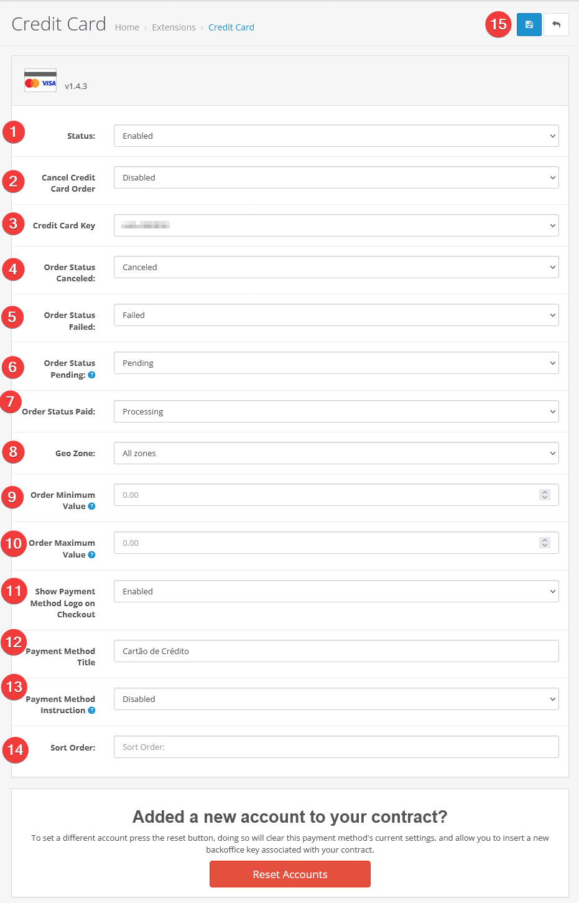

 

### Payshop

The Payshop payment method generates a reference that can be paid at any Payshop agent or affiliated store.
The Payshop Keys are automatically loaded upon entering the Backoffice Key.
Configure the payment method. The image below shows an example of a minimally functional configuration.

1. **Status** - Activates the payment method, displaying it at the checkout of your store.
2. **Sandbox** - Prevents activation of callback when saving configuration.
3. **Enable Callback** - When enabled, the order status will be updated when the payment is received.
4. **Enable Cancel Cron Job** - When enabled, allows the order cancellation cron job to run for this specific method (used when you don't want the cron job to run for all payment methods).
5. **Payshop Key** - Select a Key. You can only choose one of the Keys associated with the Backoffice Key.
6. **Deadline** - Select the number of days to deadline for the Payshop reference. From 1 to 99 days, leave empty if you don't want it to expire.
7. **Canceled Status** - Order status used when the order is canceled.
8. **Pending Status** - Order status used during order confirmation.
9. **Paid Status** - Order status used when payment confirmation is received.
10. **Geo Zone** - (optional) By selecting a geographic zone, this payment method will only be displayed for orders with a shipping address within the chosen zone.
11. **Minimum Amount** - (optional) Displays this payment method only for orders with a value greater than the entered amount.
12. **Maximum Amount** - (optional) Displays this payment method only for orders with a value lower than the entered amount.
13. **Show Payment Method Logo** - Display this payment method logo image on checkout, disabling this option will display the Payment Method Title.
14. **Title** - The title that appears to the consumer during checkout.
15. **Payment Method Instruction** - (optional) Displays an instruction message at the checkout. Used to inform the customer about the chosen payment method. Can be edited in the translations files.
16. **Sort Order** - (optional) Sorts the payment methods on the checkout page in ascending order. Lower numbers take the first position.

Click on Save (17) to save the changes.
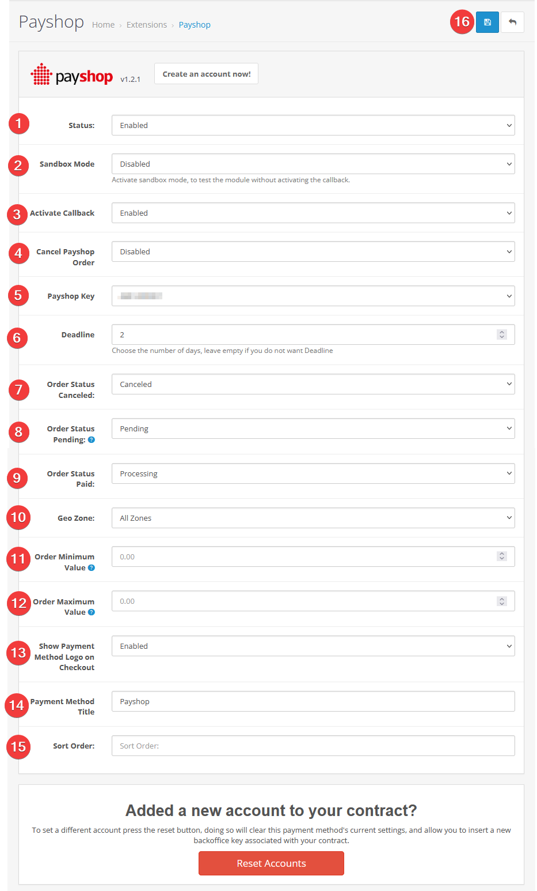

 

### Cofidis Pay

The Cofidis Pay payment method allows the consumer to pay in installments.
The Cofidis Pay Keys are automatically loaded upon entering the Backoffice Key.
Configure the payment method. The image below shows an example of a minimally functional configuration.

1. **Status** - Activates the payment method, displaying it at the checkout of your store.
2. **Sandbox** - Prevents activation of callback when saving configuration.
3. **Enable Callback** - When enabled, the order status will be updated when the payment is received.
4. **Enable Cancel Cron Job** - When enabled, allows the order cancellation cron job to run for this specific method (used when you don't want the cron job to run for all payment methods).
5. **Cofidis Pay Key** - Select a Key. You can only choose one of the Keys associated with the Backoffice Key.
6. **Canceled Status** - Order status used when the order is canceled.
7. **Approved Status** - Order status used when payment approval is received.
8. **Failed Status** - Order status used when payment fails while requesting transaction.
9. **Pending Status** - Order status used during order confirmation.
10. **Paid Status** - Order status used when payment confirmation is received.
11. **Geo Zone** - (optional) By selecting a geographic zone, this payment method will only be displayed for orders with a shipping address within the chosen zone.
12. **Minimum Amount** - (optional) Displays this payment method only for orders with a value greater than the entered amount. **Important Notice:** On Cofidis Key selection, this input is updated with value configured in ifthenpay's backoffice, and when editing, it can not be less then the value specified in ifthenpay's backoffice.;
13. **Maximum Amount** - (optional) Displays this payment method only for orders with a value lower than the entered amount. **Important Notice:** On Cofidis Key selection, this input is updated with value configured in ifthenpay's backoffice, and when editing, it can not be greater then the value specified in ifthenpay's backoffice.;
14. **Show Payment Method Logo** - Display this payment method logo image on checkout, disabling this option will display the Payment Method Title.
15. **Title** - The title that appears to the consumer during checkout.
16. **Payment Method Instruction** - (optional) Displays an instruction message at the checkout. Used to inform the customer about the chosen payment method. Can be edited in the translations files.
17. **Sort Order** - (optional) Sorts the payment methods on the checkout page in ascending order. Lower numbers take the first position.

Click on Save (18) to save the changes.
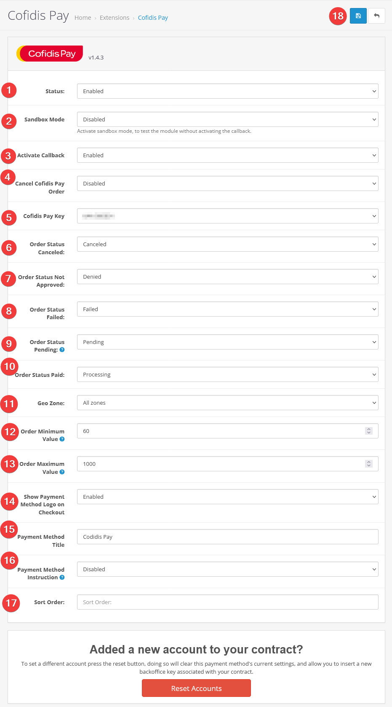

 

### Pix

The Pix payment method allows payment with CPF through the ifthenpay gateway.
The Pix Keys are automatically loaded upon entering the Backoffice Key.
Configure the payment method. The image below shows an example of a minimally functional configuration.

1. **Status** - Activates the payment method, displaying it at the checkout of your store.
2. **Sandbox** - Prevents activation of callback when saving configuration.
3. **Enable Callback** - When enabled, the order status will be updated when the payment is received.
4. **Enable Cancel Cron Job** - When enabled, allows the order cancellation cron job to run for this specific method (used when you don't want the cron job to run for all payment methods).
5. **Pix Key** - Select a Key. You can only choose one of the Keys associated with the Backoffice Key.
6. **Canceled Status** - Order status used when the order is canceled.
7. **Pending Status** - Order status used during order confirmation.
8. **Paid Status** - Order status used when payment confirmation is received.
9. **Geo Zone** - (optional) By selecting a geographic zone, this payment method will only be displayed for orders with a shipping address within the chosen zone.
10. **Minimum Amount** - (optional) Displays this payment method only for orders with a value greater than the entered amount.
11. **Maximum Amount** - (optional) Displays this payment method only for orders with a value lower than the entered amount.
12. **Show Payment Method Logo** - Display this payment method logo image on checkout, disabling this option will display the Payment Method Title.
13. **Title** - The title that appears to the consumer during checkout.
14. **Payment Method Instruction** - (optional) Displays an instruction message at the checkout. Used to inform the customer about the chosen payment method. Can be edited in the translations files.
15. **Sort Order** - (optional) Sorts the payment methods on the checkout page in ascending order. Lower numbers take the first position.

Click on Save (16) to save the changes.

 

### Ifthenpay Gateway

The Ifthenpay Gateway payment method allows the consumer to be redirected to a payment gateway page where it is possible to select any of the above payment methods to pay for the order.
The Ifthenpay Gateway Keys are automatically loaded upon entering the Backoffice Key.
Configure the payment method. The image below shows an example of a minimally functional configuration.

1. **Status** - Activates the payment method, displaying it at the checkout of your store.
2. **Sandbox** - Prevents activation of callback when saving configuration.
3. **Enable Callback** - When enabled, the order status will be updated when the payment is received.
4. **Enable Cancel Cron Job** - When enabled, allows the order cancellation cron job to run for this specific method (used when you don't want the cron job to run for all payment methods).
5. **Ifthenpay Gateway Key** - Select a Gateway Key. You can only choose one of the Keys associated with the Backoffice Key.
6. **Payment Methods** - Select a Payment Method Key per each Method and check the checkbox if you want to display it in the gateway page.
7. **Default Payment Method** - Select a Payment Method that will be selected in the gateway page by default.
8. **Deadline** - Select the number of days to deadline for the gateway page link. From 1 to 99 days, leave empty if you don't want it to expire.
9. **Gateway Close Button Text** - Text displayed in the "Return to Shop" button in the gateway page;
10. **Canceled Status** - Order status used when the order is canceled.
11. **Pending Status** - Order status used during order confirmation.
12. **Paid Status** - Order status used when payment approval is received.
13. **Geo Zone** - (optional) By selecting a geographic zone, this payment method will only be displayed for orders with a shipping address within the chosen zone.
14. **Minimum Amount** - (optional) Displays this payment method only for orders with a value greater than the entered amount.
15. **Maximum Amount** - (optional) Displays this payment method only for orders with a value lower than the entered amount.
16. **Show Payment Method Logo** - Display this payment method logo image on checkout, choose from 3 options:
    - enabled - default image: displays ifthenpay gateway logo;
    - disabled: displays Payment Method Title;
    - enabled - composite image: displays a composite image of all the payment method logos you have selected;
17. **Title** - The title that appears to the consumer during checkout.
18. **Payment Method Instruction** - (optional) Displays an instruction message at the checkout. Used to inform the customer about the chosen payment method. Can be edited in the translations files.
19. **Sort Order** - (optional) Sorts the payment methods on the checkout page in ascending order. Lower numbers take the first position.

Click on Save (20) to save the changes.
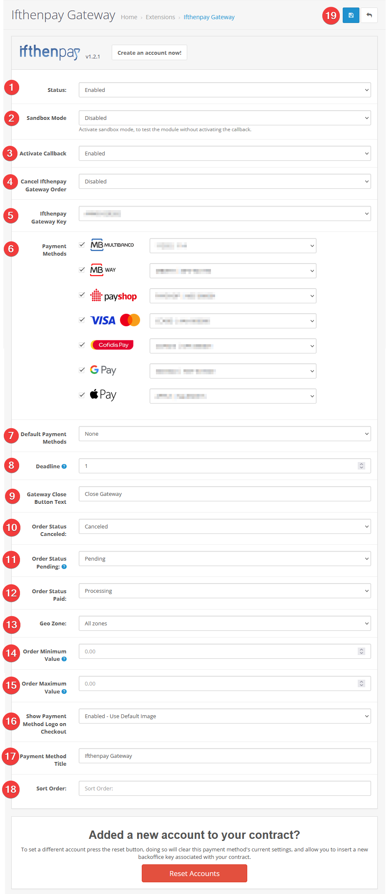

 

## Other

### Payment Instruction Message

If you enabled the Payment Method Instruction option in a any method config, the customer will now be greeted with a small explainatory message before confirming the payment.
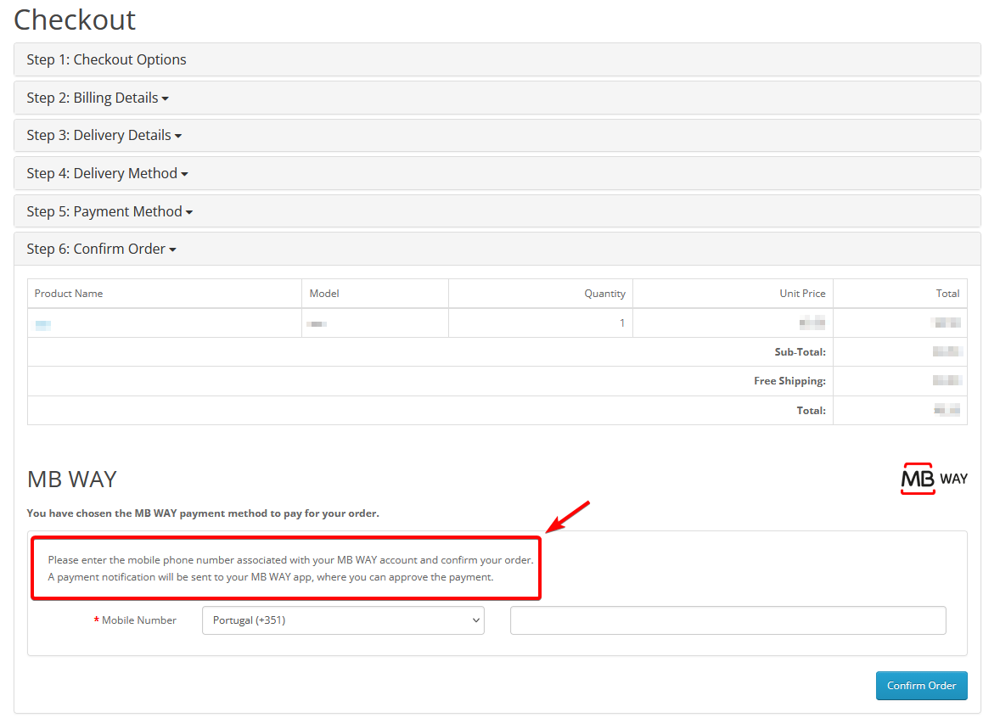

 
This message can be edited in the translation files.
Find the catalog language file you want to edit at `catalog/language/en-gb/extension/payment/{PAYMENT_METHOD}` and edit the line with "$[{PAYMENT_METHOD}] = "payment instruction text".
For example, to change the english translation for MB WAY instruction, you would go to catalog/language/en-gb/extension/payment/mbway.php, and change the text to the right of equal sign in the line with "$_['mbway_instruction']".

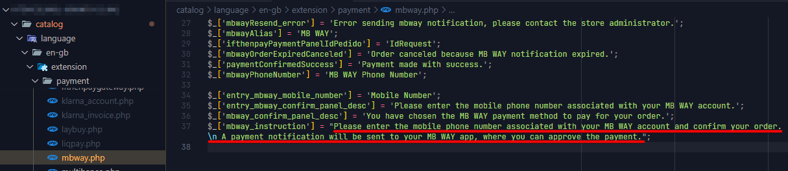

 

### Request additional account

If you already have an ifthenpay account but haven't contracted a needed payment method, you can place an automatic request with ifthenpay.
The response time for this request is 1 to 2 business days, with the exception of the Credit Card payment method, which might exceed this time due to validation requirements.
To request the creation of an additional account, access the configuration page of the payment method you wish to contract and click on Request ... Account (1).
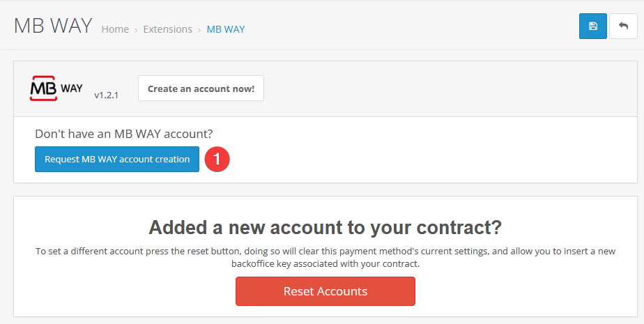
 

In the case that you already have a Multibanco account with static references and need an account for Multibanco with dynamic references, you can do so on the Multibanco configuration page by clicking on the Request Dynamic Multibanco Account button (1) at the bottom of the page.
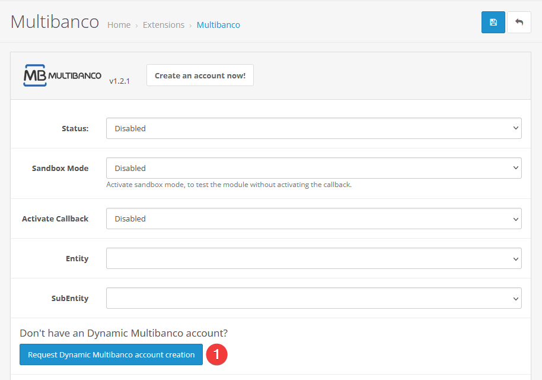
 

You may also request a method for the Ifthenpay Gateway following the same procedure by clicking button (1).
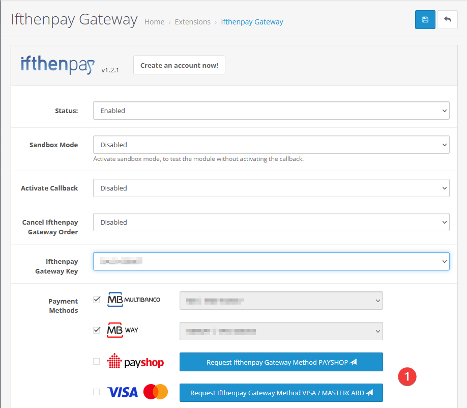
 

As a result, the ifthenpay team will add the payment method to your account, updating the list of available payment methods in your extension.

IMPORTANT: When requesting an account for the Credit Card payment method, the ifthenpay team will contact you to request more information about your online store and your business before activating the payment method.

 

### Reset Configuration

This functionality allows you to reset the configuration of the payment method and is useful in the following scenarios:

- If you have acquired a new Backoffice Key and want to assign it to your website, but you already have one currently assigned.
- If you have requested the creation of an additional account by phone or ticket and want to update the list of payment methods to use the new account.
- If you want to reset the configuration of the payment method to reconfigure it.

In the configuration of the selected payment method, click on the Reset Configuration button (1) and confirm the action by clicking OK.

**Attention, this action will clear the current payment method configuration**;

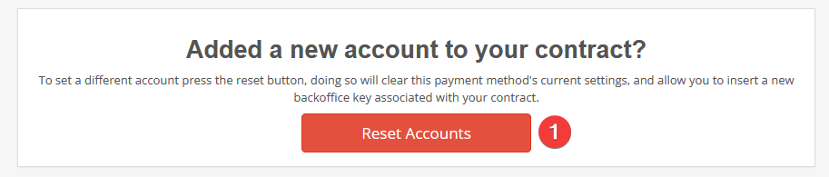
 

After clearing the configuration, you will be prompted to enter the Backoffice Key again.
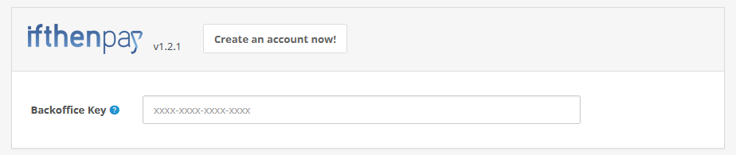

 

### Callback

IMPORTANT: Only the Multibanco, MB WAY, Payshop, Cofidis Pay, and Ifthenpay Gateway payment methods allow activating the Callback. The Credit Card method changes the order status automatically without using the Callback.

The Callback is a feature that, when enabled, allows your store to receive notifications of successful payments. Upon receiving a successful payment for an order, the ifthenpay server communicates with your store, changing the order status to "Processing." You can use ifthenpay payments without activating the Callback, but your orders won't automatically update their status.

As mentioned in the configurations above, to activate the Callback, access the extension's configuration page and enable the "Enable Callback" option. After saving the settings, the process of associating your store and payment method with ifthenpay's servers will run, and a new "Callback" group (for information only) will appear, showing the Callback status (1), the anti-phishing key (2), and the Callback URL (3).

After activating the Callback, you don't need to take any further action. The Callback is active and functioning.

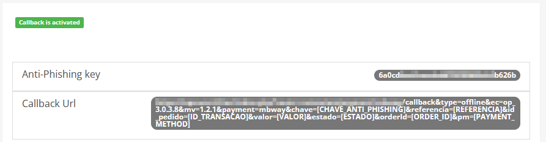

 

### Test Callback

On each payment method configuration page (except for Credit Card), you can test the Callback functionality by clicking the "Test Callback" button. This action will simulate a successful payment for an order in your store, changing its status. You need to have the Callback active to access this functionality.

 

**Multibanco**: In the backoffice, use the following data (1) and (2) from the order payment details

 

and enter them in the respective fields (1) and (2) of the Callback test form, then click on Test (3).
Note: The Multibanco reference should be entered without spaces, and the value, if it has decimals, should be separated by a dot.

 

**MB WAY**: In the backoffice, use the following data (1) and (2) from the order payment details
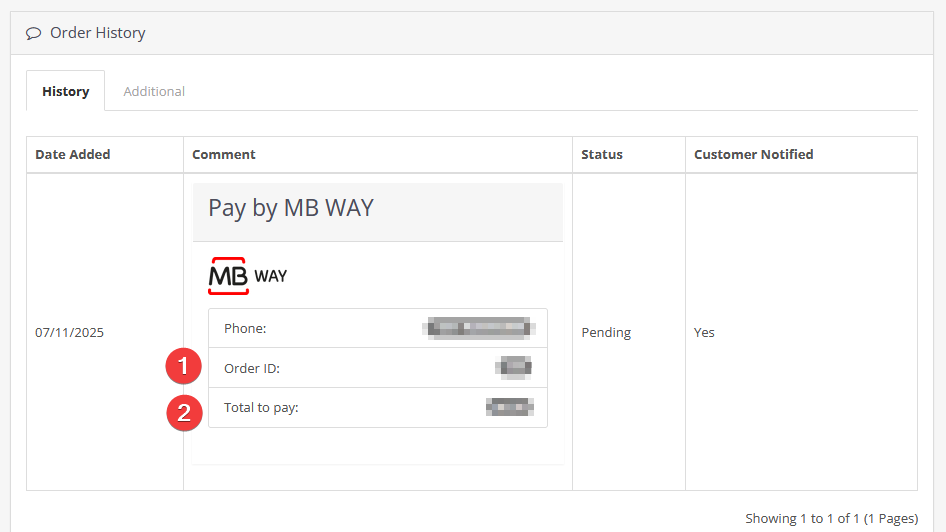
 

and enter them in the respective fields (1) and (2) of the Callback test form, then click on Test (3).
Note: The value, if it has decimals, should be separated by a dot.
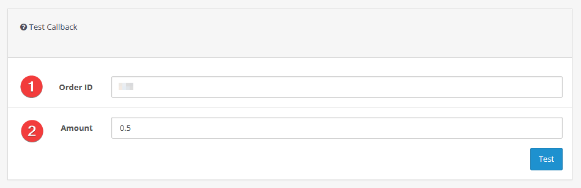

 

**Payshop**: In the backoffice, use the following data (1) and (2) from the order payment details
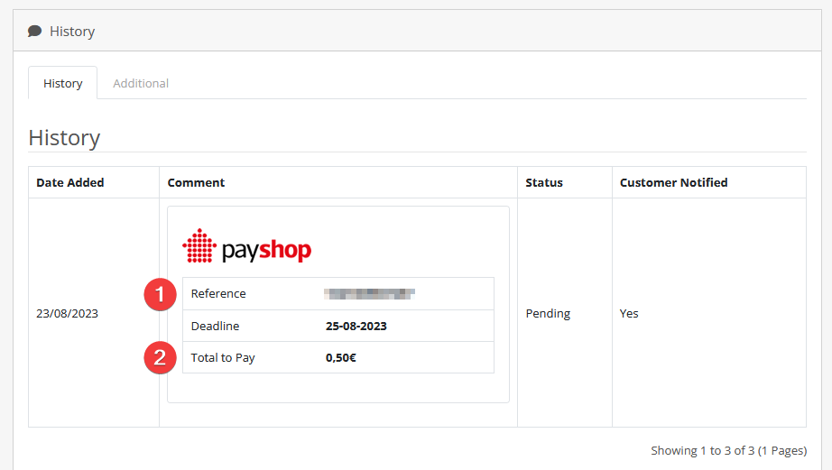
 

and enter them in the respective fields (1) and (2) of the Callback test form, then click on Test (3).
Note: The value, if it has decimals, should be separated by a dot.

 

**Cofidis Pay**: In the backoffice, use the following data (1) and (2) from the order payment details

 

and enter them in the respective fields (1) and (2) of the Callback test form, then click on Test (3).
Note: The value, if it has decimals, should be separated by a dot.

 

**Pix**: In the backoffice, use the following data (1) and (2) from the order payment details
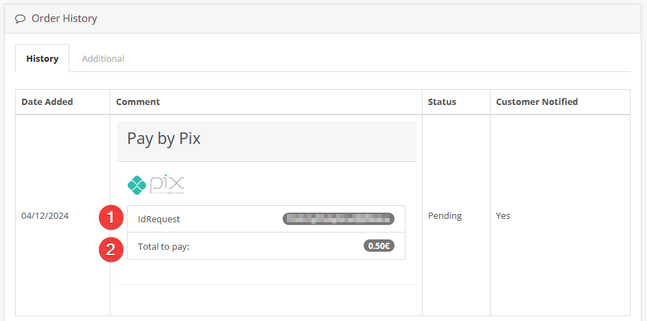
 

and enter them in the respective fields (1) and (2) of the Callback test form, then click on Test (3).
Note: The value, if it has decimals, should be separated by a dot.
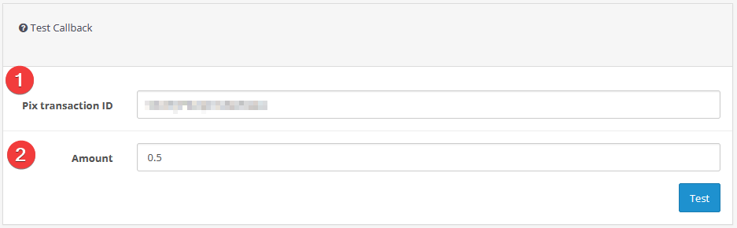

 

**Ifthenpay Gateway**: In the backoffice, use the order ID and the order amount, and enter them in the respective fields (1) and (2) of the Callback test form, then click on Test (3).
Note: The value, if it has decimals, should be separated by a dot.
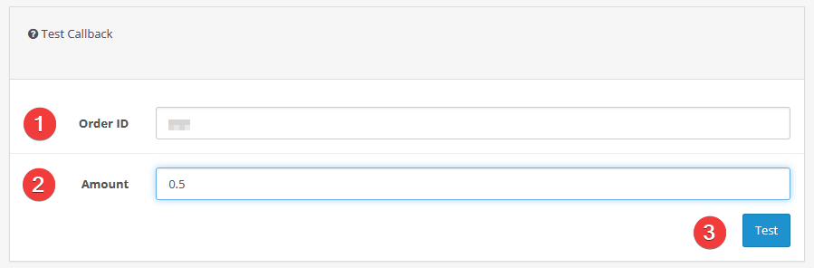

 

### Cronjob

A cron job is a scheduled task that is automatically executed at specific intervals in the system. The ifthenpay extension provides a cron job to check the payment status and cancel orders that haven't been paid within the configured time limit. The table below shows the time limit for each payment method, which the cron job checks and cancels orders that haven't been paid within the time limit. This time limit can be configured only for the Multibanco with Dynamic References and Payshop payment methods.

| Payment Method     | Payment Deadline               |
| ------------------ | ------------------------------ |
| Multibanco         | No deadline                    |
| Dynamic Multibanco | Configurable from 1 to n days  |
| MB WAY             | 4 minutes                      |
| Payshop            | Configurable from 1 to 99 days |
| Credit Card        | No deadline                    |
| Cofidis Pay        | 60 minutes                     |
| Pix                | 5 minutes                      |
| Ifthenpay Gateaway | Configurable from 1 to 99 days |

To activate the cron job, access the extension's configuration page and enable the "Enable Cancel Cron Job" option, then click on Save.
The configuration page will update and display the Cron job URL (1), which should be added to your server to execute the cron job.
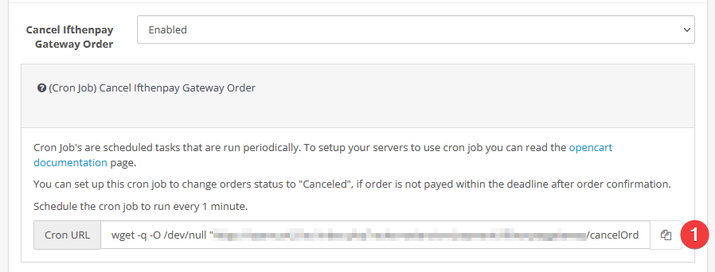

 

### Logs

For easier error detection, the ifthenpay extension logs the errors that occur during its execution. The logs are stored separately by payment method, in a text file at storage/logs/, for example storage/logs/multibanco.log. To access the logs, go to the root of the storage/ folder, navigate to the logs/ folder, and open the file of the payment method that you need to analyze.

Note: The location of the storage folder is defined after the installation of Opencart and may vary for each installation.

 

## Customer usage experience

The following describes the consumer user experience when using ifthenpay payment methods on a "stock" installation of Opencart 3. Please note that this experience might change with the addition of one-page checkout extensions.

On the checkout page, after selecting the shipping method, the consumer can choose the payment method.

 

### Paying order with Multibanco

Select the Multibanco payment method (1) and click on Continue (2).
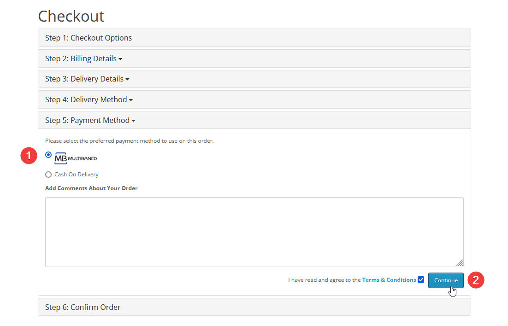
 

Click on Confirm Order.
 

The order success page will be displayed, showing the entity, reference, deadline, and the amount to pay.
Note: In the case of assigning a static Multibanco account or Multibanco with Dynamic References without setting an expiry date, the payment deadline will not be displayed.

 

### Paying order with Payshop

Select the Payshop payment method (1) and click on Continue (2).

 

Click on Confirm Order.

The order success page will be displayed, showing the reference, deadline, and the amount to pay.
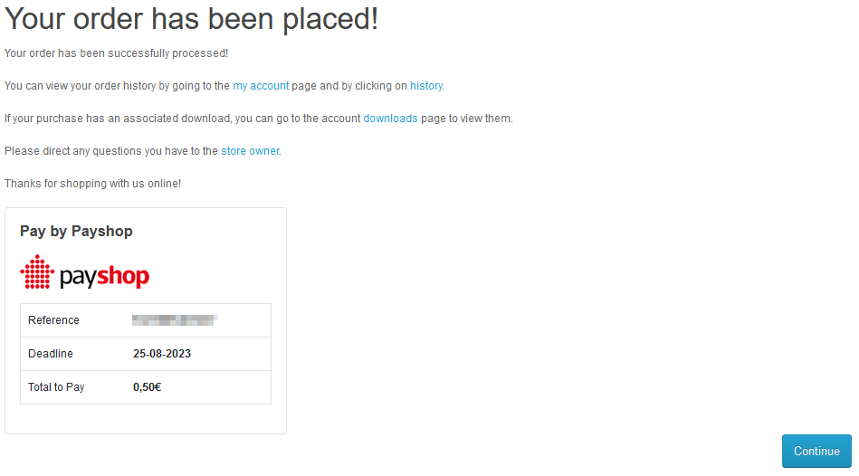

 

### Paying order with MB WAY

Select the MB WAY payment method (1) and click on Continue (2).
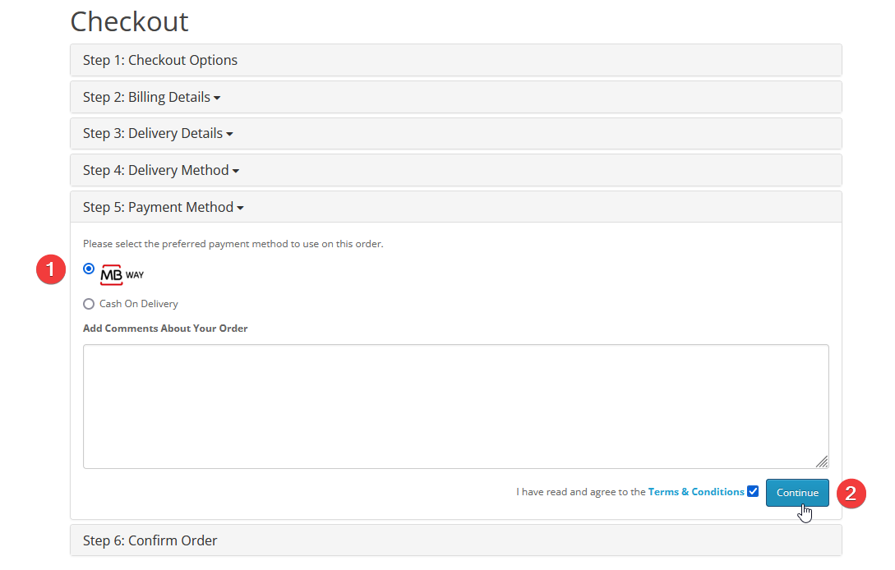
 

Fill in the mobile phone number (1) and click on Confirm Order (2).
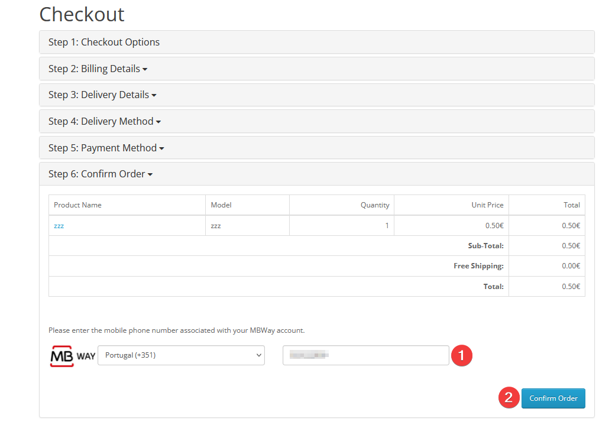
 

If the Display Countdown configuration is active, the countdown timer for the payment time limit will be displayed on the order success page.
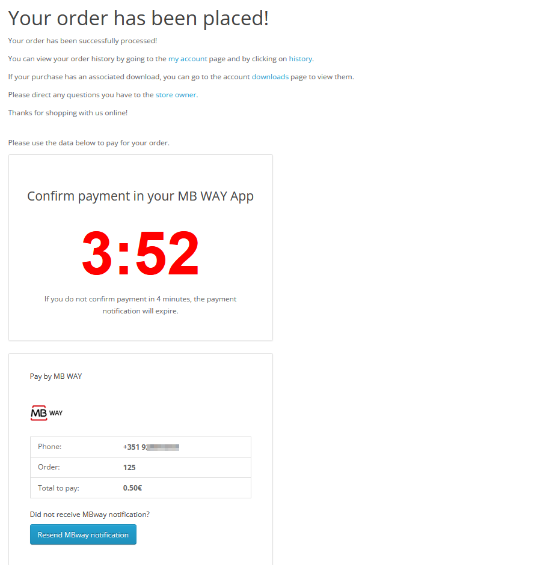
 

The timer will automatically update the payment status in case of success, rejection by the user in the MB WAY app, expiration of the time limit, or an error. In the case of success, a success message will be displayed.
 
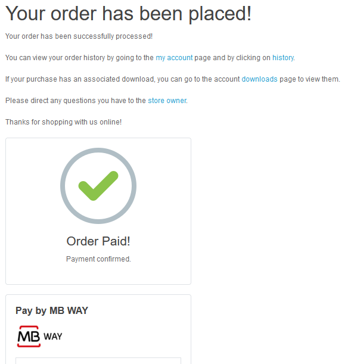
 

In case of rejection by the user, a "rejection" message will be displayed.
 

 

In case of time expiration, an "expired" message will be displayed.
 

 

In case of failure to communicate with the MB WAY app or entering an invalid phone number, an "error" message will be displayed.
 

 

When an error occurs, the time limit is reached, or the payment is declined in the MB WAY app, the consumer can try again by clicking on the "Resend MB WAY notification" button.
 

 

### Paying order with Credit Card

Select the Credit Card payment method (1) and click on Continue (2).
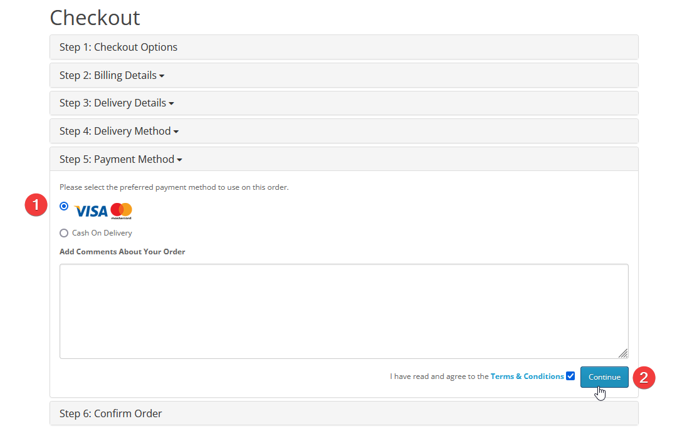
 

Click on Confirm Order.

Fill in the credit card details, card number (1), expiration date (2), security code (3), Name on Card (4), and click on Pay (5).
You can go back (6), returning to the checkout page.

 

After the payment is processed, the order success page will be displayed.
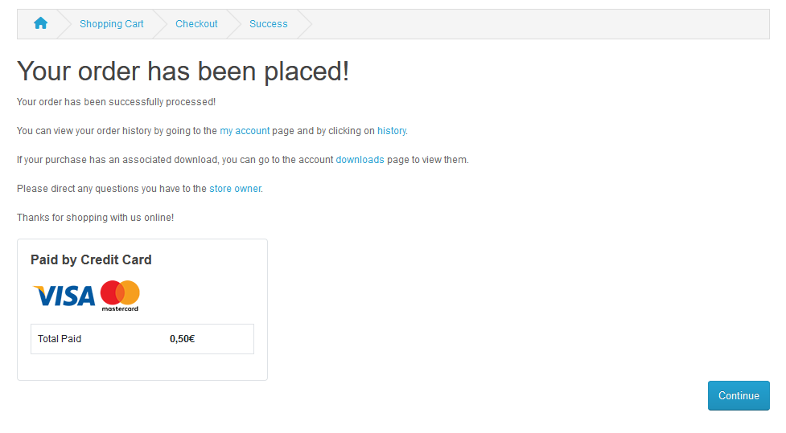

 

### Paying order with Cofidis Pay

Select the Cofidis Pay payment method (1) and click on Continue (2).
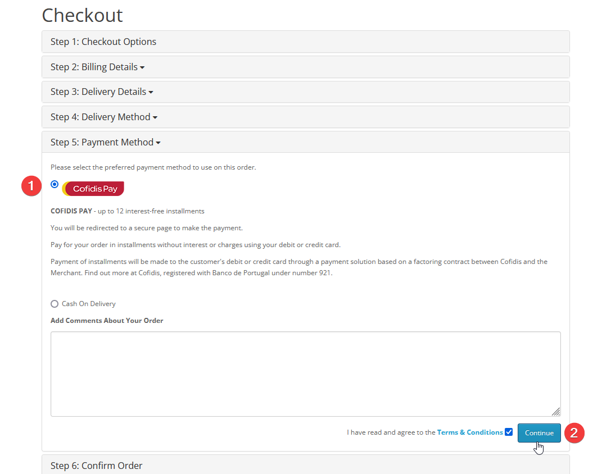
 

Click on Confirm Order.

- Login or, if you don't have an account, sign up with Cofidis Pay:

1. Click "Avançar" to sign up with Cofidis Pay;
2. Or if you have a Cofidis Pay account, fill in your access credentials and click enter;
   
    

- Number of installments and billing and personal data:

1. Select the number of installments you wish;
2. Verify the summary of the the payment plan;
3. Fill in your personal and billing data;
4. Click "Avançar" to continue;
   
    

- Terms and Conditions:

1. Select "Li e autorizo" to agree with terms and conditions;
2. Click "Avançar"
   
    

- Agreement formalization:

1. Click "Enviar código";
   
    

- Agreement formalization authentication code:

1. Fill in the code you received on your phone;
2. Click "Confirmar código";
   
    

- Summary and Payment:

1. Fill in your credit card details (number, expiration date and CW), and click "Validar";
   
    

- Success and return to store:

1. Click the return icon to return to the store;
   
    

After the payment is processed, the order success page will be displayed.
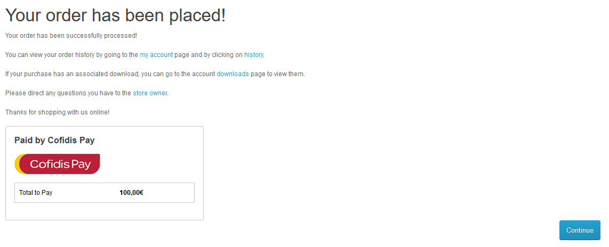
 

### Paying order with Pix

Select the Pix payment method (1) and click on Continue (2).
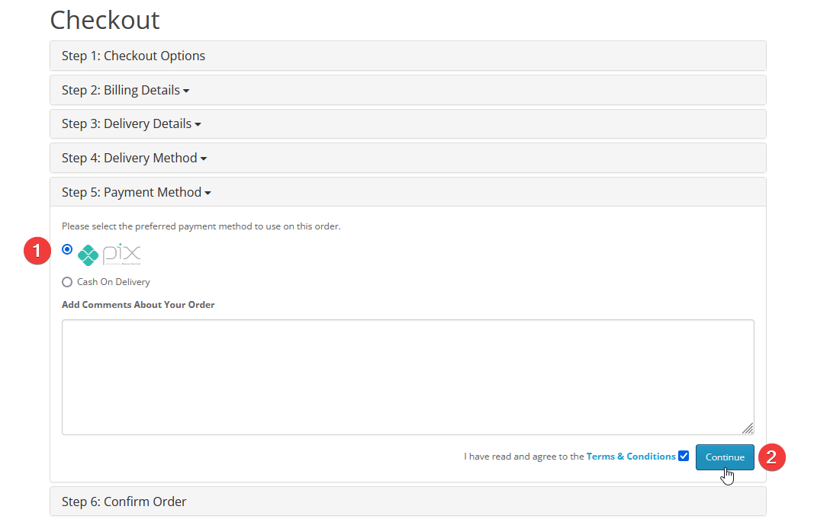
 

Fill the form (1). Only the name, CPF, and Email are required (the remaining are optional), and click on Confirm Order (2).
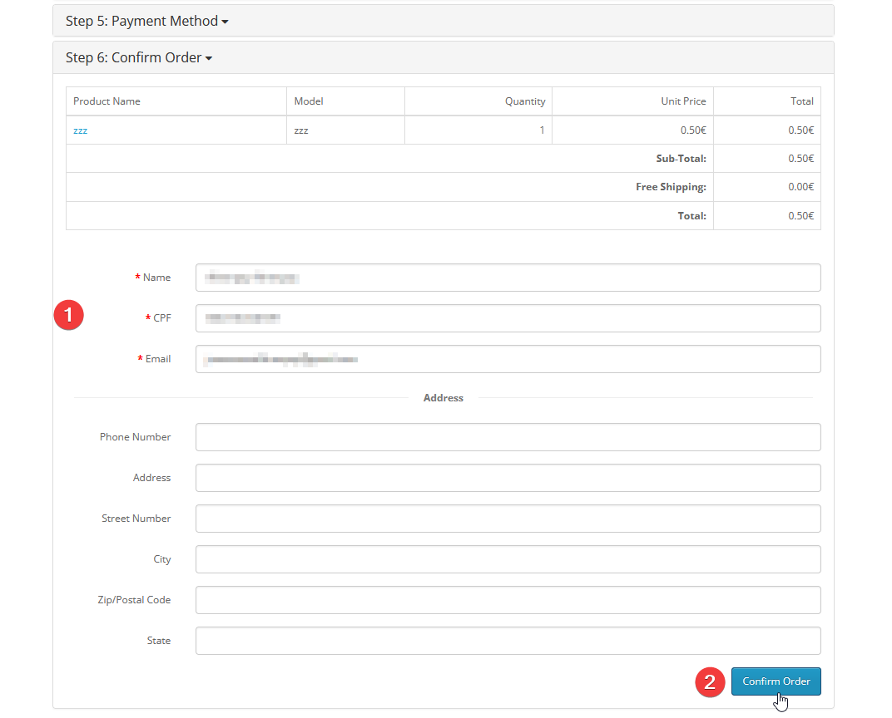
 

Proceed with payment with one of two options:

1. Reading QR code with mobile phone;
2. Copy the Pix code and pay with online banking;
**Important Note:** In order to be redirected back to the store after paying, this page must be left open. If closed the consumer will still be able to pay, as long as he has already read the Pix code, he will only not be redirected back to the store.
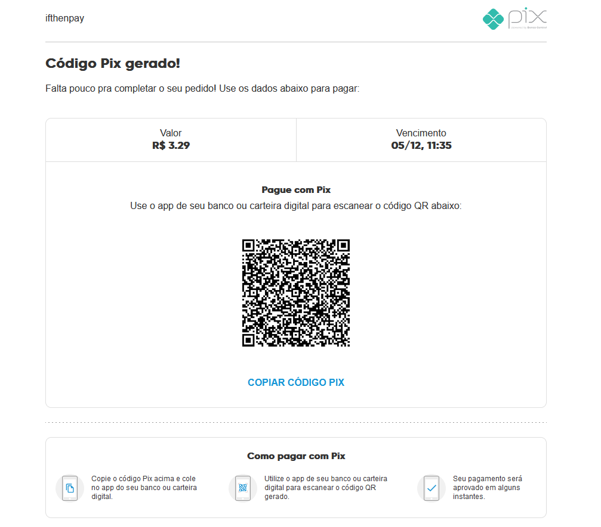
 

After the payment is processed, the order success page will be displayed.
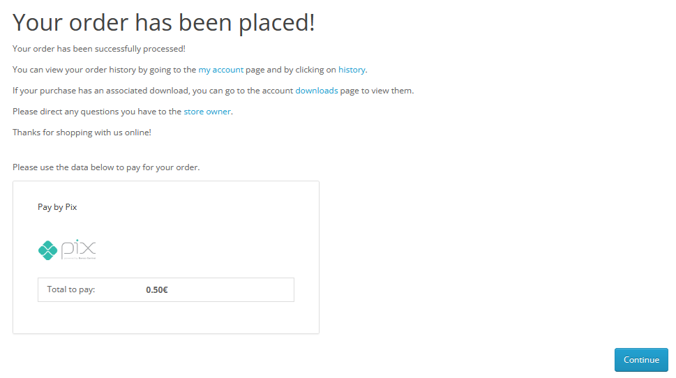
 

### Paying order with Ifthenpay Gateway

Select the Ifthenpay Gateway payment method (1) and click on Continue (2).
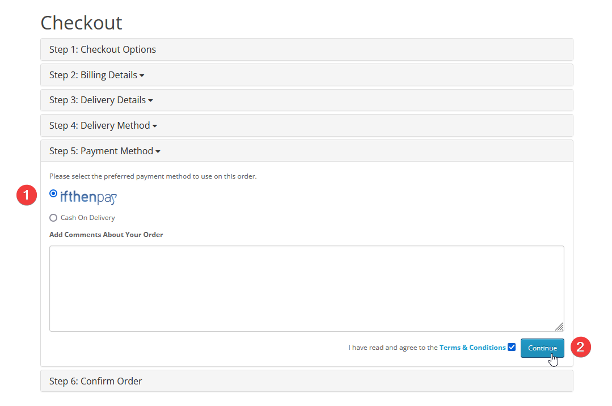
 

Click on Confirm Order.

Select one of the payment methods available in the gateway page (1).

 

In case of Multibanco method, the entity, reference and amount will be displayed.
Here the user can do one of the two:

- in case of an offline payment method, note down the payment details, click the close gateway button (2) and pay later;
- pay at that moment and click the confirm payment button (3) to verify the payment.

 

If the user did not pay at the moment and did not take note of the payment details, it is also possible to access the Ithenpay Gateway link at a later date in the user account order history or order confirmation email.

 

You have reached the end of the ifthenpay extension manual for Opencart 3.
